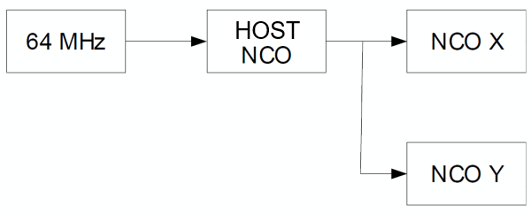

<a href="https://www.microchip.com" rel="nofollow"></a>

# PIC18F57Q84 Two Axis CNC Machine

This project demonstrates an implementation of a 2-axis Computer Numerical
Control (CNC) machine which makes use of the Numerically Controlled Oscillator (NCO), Direct Memory Address (DMA) and other Core Independent Peripherals
(CIPs) to handle acceleration and movement with minimal input from the
microcontroller core.


## Theory of Operation

This is a general overview of the application. A more complete explanation can
 be found in the associated Appllication Note.

 The NCOs are a peripheral which work by creating an output frequency which is a precise fraction of the input frequency. This output frequency is a function of two values, the input frequency, and the value of the increment register of the NCO.This project makes use of three NCOs, a host NCO which determines overall speed, and a client NCO for each axis which determines the proportion of speed in each axis, set up as shown below.

   

For instance, if the goal is to move 200 mm in the X axis, and 100 mm in the Y
axis, the X NCO can be set to produce twice the frequency of output as the
Y NCO. This means that X will move twice as fast, and therefore cover twice
the distance.

Additionally, because both frequencies are a function of the host
frequency, if the host frequency is doubled, the speed in both axes will be
doubled, while maintaining the same proportion (e.g., X will still be going twice as fast as Y, and will therefore still cover twice the distance).

The DMA is a module which can copy data from one memory location to another without any CPU intervention. DMA operation can be configured to start and/or abort based on several built-in trigger options. Acceleration of the machine can be achieved by using the DMA to gradually increase or decrease the value in the increment register of the NCO, resulting in the frequency of the host NCO, and therefore the speed of movement in the two axes, increasing or decreasing proportionally.

The distance travelled in each direction can be known by counting the number of
pulses from the host NCO. In short, this is because if the host
NCO has produced the requisite number of output ticks, the two client NCOs have
moved the steppers in both axis the correct distance.


## Related Documentation

- [PIC18F57Q84 Product Page](https://www.microchip.com/wwwproducts/en/PIC18F57Q84)
- [AN3553 - Core Independent Computer Numerical Control (CNC)](https://www.microchip.com/en-us/application-notes/an3553)

## Software Used

  - [MPLAB® X IDE v6.25](https://www.microchip.com/en-us/development-tools-tools-and-software/mplab-x-ide) or newer
  - [MPLAB® XC8 v3.10](https://www.microchip.com/en-us/tools-resources/develop/mplab-xc-compilers/xc8) or newer
  - [MPLAB® Code Configurator (MCC) v5.6.3](https://www.microchip.com/mplab/mplab-code-configurator) or newer 
  - [Microchip PIC18F-Q Series Device Support v1.18.451](https://packs.download.microchip.com/) or newer

## Hardware Used


- [PIC18F57Q43 Curiosity Nano Evaluation Kit](https://www.microchip.com/Developmenttools/ProductDetails/DM164150)
-  [Curiosity Nano Base for Click boards™](https://www.microchip.com/Developmenttools/ProductDetails/AC164162)
- 2x Stepper Click boards [(MIKROE-1528)](https://www.mikroe.com/stepper-click)
- 2 Axis CNC gantry - The code is designed to be flexible, such that it can
be modified to work with almost any XY stepper gantry selected, provided
the power requirements are not too great
- 2x Limit switches - Switches should be located such that they are pressed when the platform is at the (0, 0) position, and should be high when pressed
- 2x Stepper motors - The motors used will depend on the gantry, ensure
that they both move the end effector the same distance per tick, and must be
2-pole (4 wire) to work with the Stepper Click board
- End Effector - Choice of end effector is likewise left flexible. As configured, the end effector selected should be raised when the pin controlling it is low, and lowered when the pin is high. This can be modified as needed to work with a selected end effector.


## Setup

Most configuration is done through the `config.h` file. The configurations are:

- `TICKS_PER_METER`: the number of steps of the stepper motor required to move the end effector one meter
- `X_MAX`/`Y_MAX`: the maximum range, in steps, of the X and Y axes
- `X_BACKWARDS`/`Y_BACKWARDS`: whether to reverse the direction of the stepper
motor on this axis
- `BUFFER_NUMBER_PACKETS`: the size of the command buffer. This can be left at the default 5.

Pinout of the various pins (e.g., the limit switches, the Click boards, the
actuator, etc) is defined in `config.h` with two constants per pin,
 `NAME_PIN_PORT` and `NAME_PIN_POS`.
 For example, to have Y_ENABLE pin on RA6, the code would be:

```
#define Y_ENABLE_PIN_PORT RA
#define Y_ENABLE_PIN_POS 6
```

As configured, the Y axis Stepper Click board should go in slot 1, and the X
axis should be in slot 3 of the Curiosity Nano Base board.

By default, the limit switch pin for the Y axis is RA1, and the X axis is RC7.
The actuator is on pin RF2.

If an alternate method of controlling the actuator is desired, the relevant
functions to modify are `Platform_RaiseActuator()` and `Platform_LowerActuator()` in `platform.c` which by default simply set ACTUATOR_PIN high/low.


## Operation

The CNC machine should be connected to the PC via USB. Operation of the PC
control Graphical User Interface (GUI) is explained in detail in the readme file in the pc-application directory. An example, G-Code that will draw a star is included in that
directory.

For the purposes of creating G-Code, the machine operates in the X and Y axis,
with the location of the limit switches as (0, 0) and proceeding in the
positive direction. A value of Z0 will cause the end effector to lower, any
other value will cause it to raise.  Operation is limited to linear movement.
Movement in the Z axis and the X/Y plane simultaneously is not supported.

## Summary


The example G-Code included with the PC application creates the star shown below.


This project demonstrates the ability of CIPs to complete tasks that would
traditionally require math and timing intensive tasks done by a more expensive
microcontroller.
