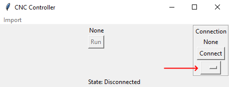
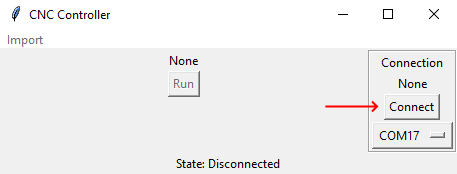
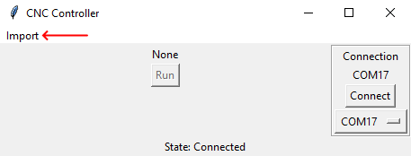
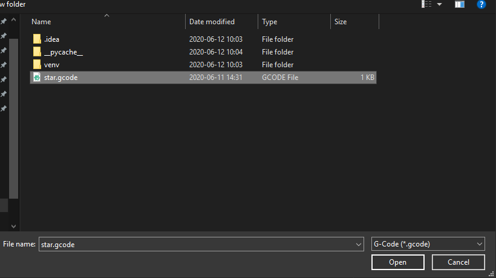
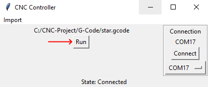

<!-- Please do not change this html logo with link -->

# Python PC Application

This is the companion PC application written in Python responsible for
parsing the G-Code and controlling the CNC machine.

## Software Used

<!-- All software used in this example must be listed here. Use unbreakable links!
     - MPLAB® X IDE 5.30 or newer [(microchip.com/mplab/mplab-x-ide)](http://www.microchip.com/mplab/mplab-x-ide)
     - MPLAB® XC8 2.10 or a newer compiler [(microchip.com/mplab/compilers)](http://www.microchip.com/mplab/compilers)
     - MPLAB® Code Configurator (MCC) 3.95.0 or newer [(microchip.com/mplab/mplab-code-configurator)](https://www.microchip.com/mplab/mplab-code-configurator)
     - MPLAB® Code Configurator (MCC) Device Libraries PIC10 / PIC12 / PIC16 / PIC18 MCUs [(microchip.com/mplab/mplab-code-configurator)](https://www.microchip.com/mplab/mplab-code-configurator)
     - Microchip PIC18F-Q Series Device Support (1.4.109) or newer [(packs.download.microchip.com/)](https://packs.download.microchip.com/) -->

- Python 3.7 [(python.org/downloads)](https://www.python.org/downloads/) - must
be Python 3.7.x
- Pyserial 10.0.1 [(pypi.org/project/pyserial)](https://pypi.org/project/pyserial/) - `pip install pyserial`
- Developed and tested on Windows 10

## Operation

Run main.py with Python (through a command prompt this would be `python main.py`)

Select the comm port of the Nano in the dropdown menu

Hit connect

The state will change to connected and you will be able to import a
G-code file. Click import

Select the G-Code file

The G-Code will be loaded and parsed. The run option will become avaible,
click it to run the routine

